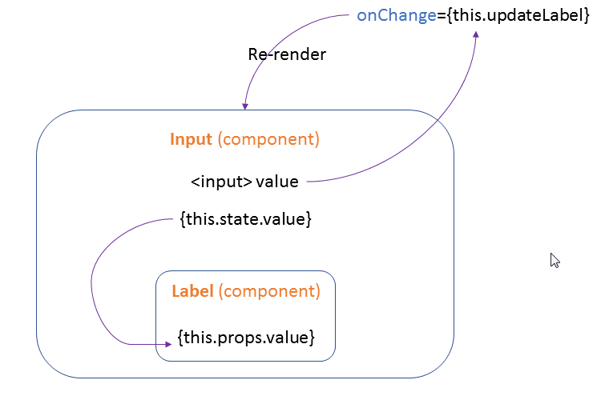

Flask + React for a Hello World example

## directory structure

One python and one html files

```bash
myApp
├── app.py
└── templates
    └── index.html
```

## app.py

```python
from flask import Flask, render_template

app = Flask(__name__)

@app.route("/")

def index():
    return render_template('index.html')

if __name__ == "__main__":
    app.run()
```

## index.html

```html
<!DOCTYPE html>
<html lang="en">
<head>
    <meta charset="UTF-8">
    <title>Flask React Tutorial</title>
    <script src="https://cdnjs.cloudflare.com/ajax/libs/react/0.13.2/react.min.js"></script>
    <script src="https://cdnjs.cloudflare.com/ajax/libs/react/0.13.2/JSXTransformer.js"></script>
</head>

<body>
     <div id="mount-point"></div>
</body>

<script type="text/jsx">

    /** @jsx React.DOM */
     var Input = React.createClass({
     
        {/* updateLabel which gets invoked when the text inside the input box changes. It updates this.state.value 
        */}
        updateLabel: function(event){
            {/* setState can trigger UI updates from event handlers and server request callbacks. 
            It will always cause a re-render to happen. */}
            this.setState({value: event.target.value});
        },
        
        {/* called once before the component mounts and responsible for setting for the initial state of a component */}
        getInitialState: function(){
            return {
                value: ''
            }
        },
        
        {/* componentWillMount is called directly before a react component is initially rendered */}
        componentWillMount: function(){
             this.setState({value: this.state.value})
        },
        
        render: function(){
            return (
                <div className="update-label">
                   <input type="text" placeholder="Enter text" onChange={this.updateLabel}/>
                   {/*  State attributes are mutable within a component.
                   They are used to represent the interaction changes changes within a component.  */}
                   <Label value={this.state.value}/>
                 </div>
            )
        }
    });

    var Label = React.createClass({
        render: function(){
            return (
            <div class="my-label">
              {/* this properties value. 
              props are immutable and used to pass data from a parent component to a child
              for this case, Label is a child component of Input */}
              <h2>{this.props.value}</h2>  
            </div>
            )
        }
    });

    {/* Input component it is bound to the element with id mount-point */}
    React.render(<Input/>, document.getElementById('mount-point'));

</script>

</html>
```


The flow diagram of React.




reference: http://aviadas.com/blog/2015/08/05/evaluating-react-dot-js-and-flask/

