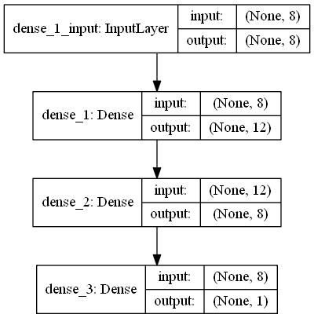

# Install Keras

----- for keras -----

open anaconda promt

```bash
pip install keras
# CPU-only version of TensorFlow
pip install --upgrade tensorflow
```

----- for Visualizing Model Structures in Keras --------

download graphviz and install in windows

open anaconda promt
```bash
conda install graphviz
conda install pip # update pip in conda
pip install graphviz # need both conda and pip install for graphviz to work

conda install pydot  
```

# Keras


cheet sheet from datacamp : http://datacamp-community.s3.amazonaws.com/94fc681d-5422-40cb-a129-2218e9522f17?imm_mid=0f769c&cmp=em-data-na-na-newsltr_20171025


```{python}
#---------------Load Data -----------------
import numpy
# fix random seed for reproducibility
numpy.random.seed(7)

# load pima indians dataset. data is from: http://archive.ics.uci.edu/ml/machine-learning-databases/pima-indians-diabetes/pima-indians-diabetes.data
dataset = numpy.loadtxt("pima-indians-diabetes.data.txt", delimiter=",")
print(dataset[0:3])

# split into input (X) and output (Y) variables
X = dataset[:,0:8]
Y = dataset[:,8]

#-------------- start Keras ----------------------
# install theano (optional)
# import theano

# install tensorflow
import tensorflow

# tensorflow is used as default backend 
import keras
from keras.models import Sequential
from keras.layers import Dense

# -------------  create model ------------------------
# create a Sequential model and add layers one at a time until we are happy with our network topology
model = Sequential()

# input_dim argument and setting it to 8 for the 8 input variables.
# The first layer has 12 neurons and expects 8 input variables. The second hidden layer has 8 neurons and finally, the output layer has 1 neuron to predict the class (onset of diabetes or not).

# will use the rectifier ('relu') activation function on the first few layers and the sigmoid function in the output layer.

# initialize network weights : random number generated from a 'uniform' distribution between 0 and 0.05 as default.  Another traditional alternative would be 'normal' for small random numbers generated from a Gaussian distribution.

model.add(Dense(12, input_dim=8, activation='relu'))
model.add(Dense(8, activation='relu'))
model.add(Dense(1, activation='sigmoid'))

# -------------  Compile model -----------------------
# Compiling the model uses the efficient numerical libraries under the covers (the so-called backend) such as Theano or TensorFlow

# use logarithmic loss, which for a binary classification problem is defined in Keras as 'binary_crossentropy'. 
# Use the efficient gradient descent algorithm 'adam' for no other reason that it is an efficient default.
# because it is a classification problem, we will collect and report the classification accuracy as the metric.
model.compile(loss='binary_crossentropy', optimizer='adam', metrics=['accuracy'])

# -------------- Fit the model ------------------------
# train or fit our model on our loaded data by calling the fit() function on the model.

# epochs =  a fixed number of iterations through the dataset
# batch_size = the number of instances for each iterations/batch
# these can be chosen experimentally by trial and error.
model.fit(X, Y, epochs=10, batch_size=20)


# ------------- evaluate the model ----------------------
# evaluate() function on your model and pass it the same input and output used to train the model.
scores = model.evaluate(X, Y)
print("\n%s: %.2f%%" % (model.metrics_names[1], scores[1]*100))


# -----------  predictions ------------------------------
predictions = model.predict(X)
# round predictions
rounded = [round(x[0]) for x in predictions]
print(rounded)


#-------- 

The first output is the weight matrix W and the second output is the bias vector b

#------------ for Visualizing Model Structures ---------------

import graphviz

# set Graphviz path
import os
os.environ["PATH"] += os.pathsep + 'C:/Program Files (x86)/Graphviz2.38/bin/'

from keras.utils import plot_model
### Build, Load, and Compile your model
plot_model(model, to_file='model.png', show_shapes=True, show_layer_names=True)


```
Output image:



reference : http://machinelearningmastery.com/tutorial-first-neural-network-python-keras/


