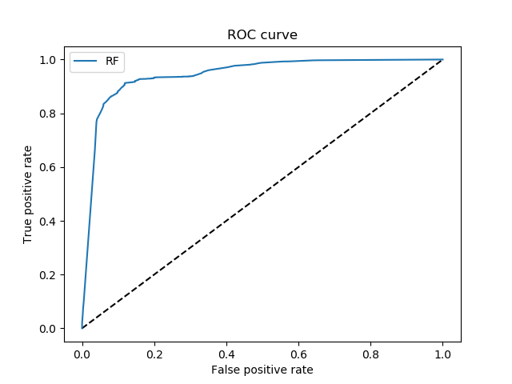

# scikit-learn

```python
from sklearn.datasets import load_breast_cancer
cancer = load_breast_cancer()
cancer.keys()
// dict_keys(['DESCR', 'data', 'feature_names', 'target_names', 'target'])

cancer['data'].shape
X = cancer['data']
y = cancer['target']

# Train Test Split
from sklearn.model_selection import train_test_split
X_train, X_test, y_train, y_test = train_test_split(X, y)

from sklearn.preprocessing import StandardScaler
scaler = StandardScaler()
# Fit only to the training data
scaler.fit(X_train)
```


# Random Forest


```python
from sklearn.datasets import make_classification
from sklearn.ensemble import (RandomTreesEmbedding, RandomForestClassifier)
from sklearn.model_selection import train_test_split
from sklearn.metrics import roc_curve
import matplotlib.pyplot as plt

# build data set
X, y = make_classification(n_samples=40000)
X_train, X_test, y_train, y_test = train_test_split(X, y, test_size=0.5)


# random forests - Supervised classifier
n_estimator = 10
rf = RandomForestClassifier(max_depth=3, n_estimators=n_estimator)
rf.fit(X_train, y_train)

# The random forest model by itself
y_pred_rf = rf.predict_proba(X_test)[:, 1]
fpr_rf, tpr_rf, _ = roc_curve(y_test, y_pred_rf)


plt.figure(1)
plt.plot([0, 1], [0, 1], 'k--')

plt.plot(fpr_rf, tpr_rf, label='RF')
plt.xlabel('False positive rate')
plt.ylabel('True positive rate')
plt.title('ROC curve')
plt.legend(loc='best')

# plt.show()
plt.savefig("pyton_random_forest.png")

```

Output image:



# k-fold RoC curve

```python
# k-fold RoC curve
from sklearn.datasets import make_classification
from sklearn.ensemble import (RandomTreesEmbedding, RandomForestClassifier)
from sklearn.model_selection import StratifiedKFold
from sklearn.metrics import roc_curve, auc
from scipy import interp
import matplotlib.pyplot as plt
import numpy as np
import pandas as pd

# build data set
X, y = make_classification(n_samples=30000)
X = pd.DataFrame(X, index=np.arange(0,len(X)))
y = pd.DataFrame(y, index=np.arange(0,len(y)))

# Run classifier with cross-validation and plot ROC curves
cv = StratifiedKFold(n_splits=5) # 5-fold
classifier = RandomForestClassifier(n_estimators=3) # 3 trees
tprs = [] # true positive rate
aucs = []
mean_fpr = np.linspace(0, 1, 300)


plt.figure(2)
i = 0
for train, test in cv.split(X, y):
    probas_ = classifier.fit(X.loc[train], y.loc[train]).predict_proba(X.loc[test])
    # Compute ROC curve and area the curve
    fpr, tpr, threshold = roc_curve(y.loc[test], probas_[:, 1])
    # print(pd.DataFrame({"tpr_rf": tpr_rf, "fpr_rf": fpr_rf}))
    tprs.append(interp(mean_fpr, fpr, tpr))
    tprs[-1][0] = 0.0
    roc_auc = auc(fpr, tpr) # calculate auc based on false positive and true positive rate
    aucs.append(roc_auc)
    plt.plot(fpr, tpr, lw=1, alpha=0.3, label='ROC fold %d (AUC = %0.2f)' % (i, roc_auc) )
    i += 1


# add the luck AUC line into the plot
plt.plot([0, 1], [0, 1], linestyle='--', lw=2, color='r', label='Luck', alpha=.8)

# calculate the mean AUC plot
mean_tpr = np.mean(tprs, axis=0) # mean for each 'column'
mean_tpr[-1] = 1.0
mean_auc = auc(mean_fpr, mean_tpr)
std_auc = np.std(aucs)
plt.plot(mean_fpr, mean_tpr, color='b', label=r'Mean ROC (AUC = %0.2f $\pm$ %0.2f)' % (mean_auc, std_auc), lw=2, alpha=.8)

pd.DataFrame({"mean_tpr": mean_tpr, "mean_fpr": mean_fpr})


std_tpr = np.std(tprs, axis=0)
tprs_upper = np.minimum(mean_tpr + std_tpr, 1)
tprs_lower = np.maximum(mean_tpr - std_tpr, 0)
plt.fill_between(mean_fpr, tprs_lower, tprs_upper, color='grey', alpha=.2, label=r'$\pm$ 1 std. dev.')

plt.xlim([-0.05, 1.05])
plt.ylim([-0.05, 1.05])
plt.xlabel('False Positive Rate')
plt.ylabel('True Positive Rate')
plt.title('ROC result')
plt.legend(loc="lower right")

# plt.show()
plt.savefig("pyton_scikit_roc.png")
```

Output image:

