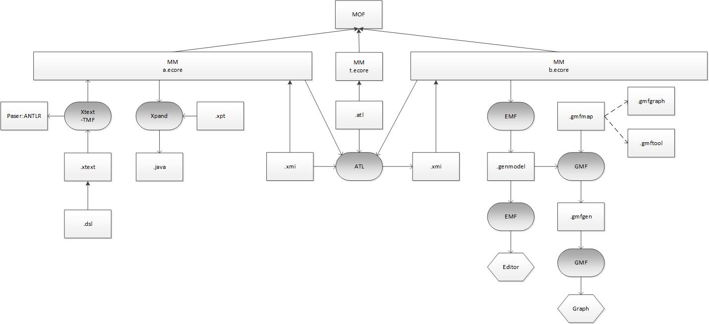

# Eclipse Modeling



# Xtext 

http://www.openarchitectureware.org/pub/documentation/4.3/html/contents/xtext_tutorial.html#xtext_dsl_grammar


## Customizing Xtext ##

### Syntax Highlighting ###

http://www.drdobbs.com/architecture-and-design/customizing-xtext/231902091?pgno=3

Go to the pre-existing `org.*.Domainmodel.ui` package in the `org.*.Domainmodel.ui` project

  1. Create two components or classes.
    * `HighlightingConfiguration`, for defining the high lighting style
    * `SemanticHighlightingCalculator`, for finding the high lighting elements.
  1. Bind the two components to the UI.


The `HighlightingConfiguration` class example:

```java
public class DomainmodelHighlightingConfiguration extends DefaultHighlightingConfiguration 
{
 
    public static final String DATA_TYPE_ID = "datatype";
 
    public void configure(IHighlightingConfigurationAcceptor
 acceptor)
    {
        super.configure(acceptor);
        acceptor.acceptDefaultHighlighting(
DATA_TYPE_ID, "DataType", dataTypeTextStyle());
    }
 
    public TextStyle dataTypeTextStyle()
    {
        TextStyle textStyle = defaultTextStyle().copy();
        textStyle.setStyle(SWT.ITALIC);
        return textStyle;
    }
}
```


The `SemanticHighlightingCalculator` class example:

```java
public class DomainmodelSemanticHighlightingCalculator implements ISemanticHighlightingCalculator
{
    public void provideHighlightingFor(XtextResource resource,
            IHighlightedPositionAcceptor acceptor)
{
        for(Iterator<EObject> contents = resource.getAllContents();
            contents.hasNext(); )
        {
            EObject element = contents.next();
            if (element instanceof Feature &&
                ((Feature) element).getType() instanceof DataType)
                highlightAsDataType(element,
                    DomainmodelPackage.Literals.FEATURE__TYPE,
                    acceptor);
            else if(element instanceof DataType)
                highlightAsDataType(element,
                    DomainmodelPackage.Literals.TYPE__NAME,
                    acceptor);
        }
    }
     
    protected void highlightAsDataType(EObject element,
            EStructuralFeature feature,
            IHighlightedPositionAcceptor acceptor){
        for(INode node:
            NodeModelUtils.findNodesForFeature(element, feature))
            acceptor.addPosition(node.getOffset(),
               node.getLength(),                         
                   DomainmodelHighlightingConfiguration.DATA_TYPE_ID);
    }
}
```


Bind the ighlightingConfiguration to the UI. Add the following methods in the pre-existing class DomainmodelUiModule Class.

```
public Class<? extends DefaultHighlightingConfiguration> bindSemanticConfig() {
		return DomainmodelHighlightingConfiguration.class;
	}

public Class<? extends ISemanticHighlightingCalculator> bindISemanticHighlightingCalculator() {
		return DomainmodelHighlightingCalculator.class;
	}


```